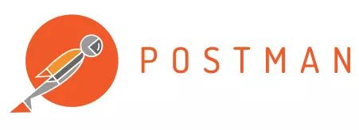

# My Postman Collections

## General Information
- This repository is a set of my collections created in Postman API
- The aim of the project is to learn, work and raise qualifications

## Technologies Used
- [Postman app](https://www.postman.com/downloads/)

## Project Status
Project is: _in progress_

## Acknowledgements
Give credit here.
- This project was inspired by [SDA Polska](https://sdacademy.pl/).
- This project is based on:
  
  >[Valentin Despa introduction-to-postman-course](https://github.com/vdespa/introduction-to-postman-course)
  
  >[Trello](https://trello.com/) & [API Introduction](https://developer.atlassian.com/cloud/trello/guides/rest-api/api-introduction/)
  
- Many thanks to:
  >[Wojciech Białasek](https://www.linkedin.com/in/wojciech-bia%C5%82asek-a84a58ab/) for the introduction and help in exploring the topic

## Contact
Created by [Jakub Kosiorek](https://www.linkedin.com/in/jakubkosiorek/) - feel free to contact me!
